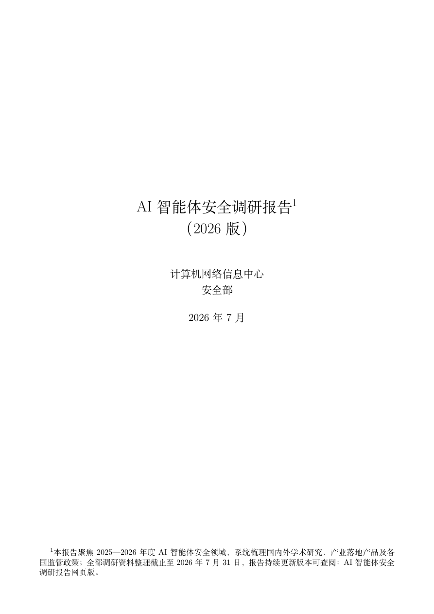

# AI 智能体安全调研报告



本项目是《AI 智能体安全调研报告》的交互式 Web 阅读与数据浏览前端。网站将报告中的章节正文、研究机构、安全产品、事件与漏洞、政策法规、统计表格和参考文献组织成可检索、可筛选的专题页面，便于研究人员、产业从业者和安全管理人员快速定位信息并开展横向比较。

报告由中国科学院计算机网络信息中心网络空间安全技术与应用发展部编制，围绕 AI 智能体全生命周期中的风险机理、威胁演化、防护方案与未来趋势展开系统调研。

> 当前收录版本：2026 版（终稿），发布于 2026 年 7 月 31 日。报告共 187 页，包含 48 张表、22 幅图和 1243 条参考文献。

[阅读完整 PDF](public/AI_智能体安全调研报告.pdf)

## 调研内容

报告从全生命周期视角分析 AI 智能体安全问题，覆盖需求规划、架构设计、编码开发、安全测试、部署交付、运行维护和退役下线七个阶段，并从感知、记忆、决策、行动、交互与治理六类核心能力出发，梳理安全风险、防护机制和攻防演化趋势。

网站同时整理了以下专题内容：

- 全球高校、科研机构和产业团队的智能体安全研究进展
- 北美、欧洲与中国的智能体安全产品和产业生态
- AI 硬件、芯片、可信计算和国产算力安全研究
- 智能体安全事件、典型漏洞及自动化攻击工具
- 全球 AI 智能体治理政策、法规与出口管制规则
- 报告第 2–6 章的全部原始表格和参考文献

## 网站功能

| 页面 | 功能 |
| --- | --- |
| 首页 | 展示报告概况、核心统计数据和主要专题入口 |
| 专题调研 | 按章节和小节阅读报告正文、图表及关联数据 |
| 研究与技术 | 浏览全球研究机构、产学协作和软硬件安全研究成果 |
| 安全产品 | 对比不同地区主流厂商、产品能力和技术路线 |
| 事件与漏洞 | 查看安全事件时间线、典型漏洞与攻击工具 |
| 政策法规 | 汇总各地区 AI 安全治理与出口管制政策 |
| 完整表格 | 搜索、筛选并浏览报告中的 48 张原始数据表 |
| 参考文献 | 检索报告引用文献并访问可用的在线来源 |

## 技术栈

- React 19
- TypeScript 6
- Vite 8
- React Router 7
- Tailwind CSS 4
- Lucide React

## 本地运行

请先安装 [Node.js](https://nodejs.org/) 和 npm，然后执行：

```bash
git clone https://github.com/qzx-ikun/SecurityReport.git
cd SecurityReport
npm install
npm run dev
```

开发服务器启动后，根据终端提示在浏览器中访问本地地址，通常为 `http://localhost:5173`。

## 构建与预览

```bash
# 执行 TypeScript 检查并生成生产构建
npm run build

# 在本地预览生产构建
npm run preview

# 执行代码检查
npm run lint
```

生产文件默认生成在 `dist/` 目录中。

## 项目结构

```text
SecurityReport/
├─ public/
│  ├─ AI_智能体安全调研报告.pdf   # 完整报告 PDF
│  ├─ report-cover.png            # 报告封面
│  └─ report-figures/             # 报告插图
├─ src/
│  ├─ components/                 # 布局与通用展示组件
│  ├─ data/
│  │  └─ latestReportData.ts      # 网页使用的报告正文、表格与文献数据
│  ├─ pages/                      # 各专题页面
│  ├─ App.tsx                     # 路由配置
│  └─ main.tsx                    # 应用入口
├─ package.json
└─ vite.config.ts
```

## 内容更新

网页的主要报告数据集中维护在 `src/data/latestReportData.ts`。更新正文、表格或参考文献后，建议依次执行：

```bash
npm run build
npm run lint
```

对于表格数据，请确保每一行的列数与 `columns` 定义一致；对于新增图片，请将文件放入 `public/report-figures/`，并使用以 `/report-figures/` 开头的站内路径引用。

## 引用与使用说明

本仓库用于报告内容的在线展示与研究资料浏览。引用报告中的结论、数据、图表或文献时，请以仓库内的完整 PDF 和原始参考文献为准，并注明报告名称、编制单位和版本信息。

本项目涉及的第三方论文、产品、政策文件及网络资料，其版权归原作者或相应机构所有。
